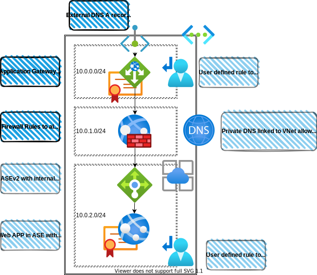
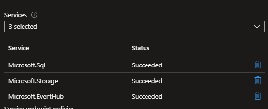
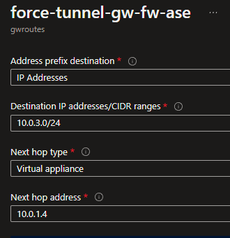
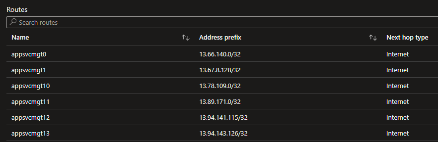
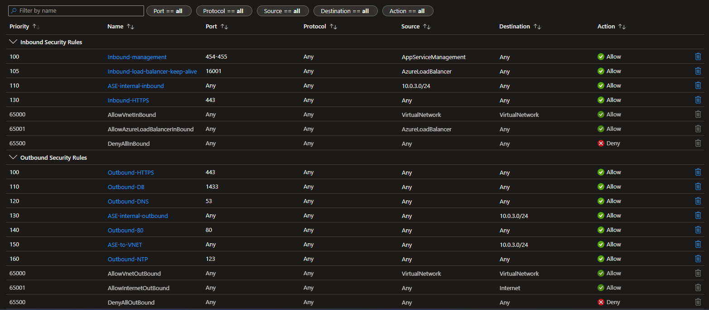
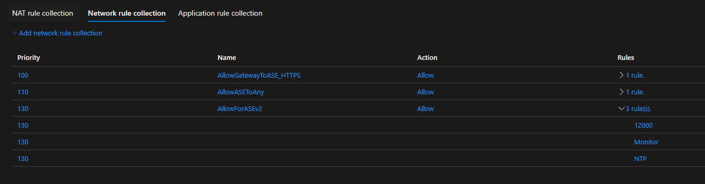
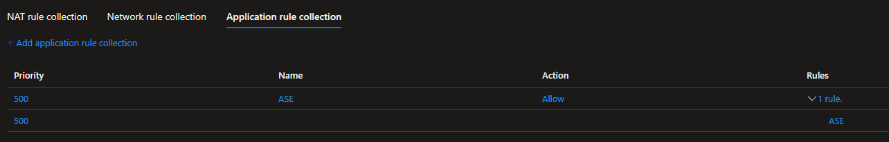

# demo-asev2-bicep

A demo built on in Bicep to implement an ASEv2, it includes

- Application Gateway with public IP to handle various routing requirements
- Azure Firewall with forced tunneling for both ingress and egress
- Firewall rules required for management of ASE
- ASEv2 with internal load balancer
- Route table with routes to support forced tunneling along side ASEv2 management.
- Private DNS Zone to allow reuse of the same domain and certs exposed externally

What it doesn't included and should be part of any production deployment

- Identity and access i.e. RBAC, resource identities (MSI / Service Principals)
- Additional NSGs and NSG rules to help restrict traffic between subnets
- Additional firewall rules based on application requirements



The full implementation of bicep is in *main.bicep* but below I have called out some essentials parts to allow for the routing requirements of this demo and for a healthy ASE.

# ASE setup
## ASE Subnet

The ASE subnet will require the service endpoints to be enabled. Even if you are not using Service Points and are consuming downstream services like SQL via Private Endpoints (which is recommended) these service endpoints will still need to be added to allow the ASE to be shown as healthy.



```bicep
resource ase 'Microsoft.Network/virtualNetworks/subnets@2022-01-01' = {
  name: 'ase'
  parent: vnet
  properties: {
    networkSecurityGroup: {
      id: asensg.id
    }
    routeTable: {
      id: aseroutes.id
    }
    addressPrefix: cidrs.ase
    serviceEndpoints: [
      {
        service: 'Microsoft.Sql'
        locations: [
          location
        ]
      }
      {
        service: 'Microsoft.Storage'
        locations: [
          location
        ]
      }
      {
        service: 'Microsoft.EventHub'
        locations: [
          location
        ]
      }
    ]
  }
}
```

## User Defined routes

UDRs will be required when you need to have forced tunneling. There is a large selection of IPs that are needed when using ASEv2 which are not required when using ASEv3.

The route tables have also be split into 2 different route tables to remove any circular references during deployment of the infrastructure





```bicep
var static_routes = [
  {
    name: 'force-tunnel-ase-fw-gw'
    properties: {
      nextHopType: 'VirtualAppliance'
      nextHopIpAddress: firewall.properties.ipConfigurations[0].properties.privateIPAddress
      addressPrefix: cidrs.gateway
    }
  }
  {
    name: 'force-tunnel-everything-else'
    properties: {
      nextHopType: 'VirtualAppliance'
      nextHopIpAddress: firewall.properties.ipConfigurations[0].properties.privateIPAddress
      addressPrefix: '0.0.0.0/0'
    }
  }
]

var app_service_management_ips = [
  '13.66.140.0'
  '13.67.8.128'
  '13.69.64.128'
  '13.69.227.128'
  '13.70.73.128'
  '13.71.170.64'
  '13.71.194.129'
  '13.75.34.192'
  '13.75.127.117'
  '13.77.50.128'
  '13.78.109.0'
  '13.89.171.0'
  '13.94.141.115'
  '13.94.143.126'
  '13.94.149.179'
  '20.36.106.128'
  '20.36.114.64'
  '20.37.74.128'
  '23.96.195.3'
  '23.102.188.65'
  '40.69.106.128'
  '40.70.146.128'
  '40.71.13.64'
  '40.74.100.64'
  '40.78.194.128'
  '40.79.130.64'
  '40.79.178.128'
  '40.83.120.64'
  '40.83.121.56'
  '40.83.125.161'
  '40.112.242.192'
  '51.107.58.192'
  '51.107.154.192'
  '51.116.58.192'
  '51.116.155.0'
  '51.120.99.0'
  '51.120.219.0'
  '51.140.146.64'
  '51.140.210.128'
  '52.151.25.45'
  '52.162.106.192'
  '52.165.152.214'
  '52.165.153.122'
  '52.165.154.193'
  '52.165.158.140'
  '52.174.22.21'
  '52.178.177.147'
  '52.178.184.149'
  '52.178.190.65'
  '52.178.195.197'
  '52.187.56.50'
  '52.187.59.251'
  '52.187.63.19'
  '52.187.63.37'
  '52.224.105.172'
  '52.225.177.153'
  '52.231.18.64'
  '52.231.146.128'
  '65.52.172.237'
  '65.52.250.128'
  '70.37.57.58'
  '104.44.129.141'
  '104.44.129.243'
  '104.44.129.255'
  '104.44.134.255'
  '104.208.54.11'
  '104.211.81.64'
  '104.211.146.128'
  '157.55.208.185'
  '191.233.50.128'
  '191.233.203.64'
  '191.236.154.88'
]

var built_rules = [for (item, index) in app_service_management_ips: {
  name: 'appsvcmgt${index}'
  properties: {
    nextHopType: 'Internet'
    addressPrefix: '${item}/32'
  }
}]

resource gwroutes 'Microsoft.Network/routeTables@2022-01-01' = {
  name: 'gwroutes'
  location: location

  properties: {
    routes: [
      {
        name: 'force-tunnel-gw-fw-ase'
        properties: {
          nextHopType: 'VirtualAppliance'
          nextHopIpAddress: firewall.properties.ipConfigurations[0].properties.privateIPAddress
          addressPrefix: cidrs.ase
        }
      }
    ]
  }
}

resource aseroutes 'Microsoft.Network/routeTables@2022-01-01' = {
  name: 'aseroutes'
  location: location

  properties: {
    routes: concat(built_rules, static_routes)
  }
}
```

## NSG rules for ASEv2 management

Again this is a requirement for ASEv2 to allow traffic for management of the ASE. It also includes a rule for 443 for end to end TLS for the demo.



```bicep
resource asensg 'Microsoft.Network/networkSecurityGroups@2022-01-01' = {
  name: 'asensg'
  location: location

  properties: {
    securityRules: [
      {
        name: 'Inbound-management'
        properties: {
          description: 'Used to manage ASE from public VIP'
          protocol: '*'
          sourcePortRange: '*'
          destinationPortRange: '454-455'
          sourceAddressPrefix: 'AppServiceManagement'
          destinationAddressPrefix: '*'
          access: 'Allow'
          priority: 100
          direction: 'Inbound'
        }
      }
      {
        name: 'Inbound-load-balancer-keep-alive'
        properties: {
          description: 'Allow communication to ASE from Load Balancer'
          protocol: '*'
          sourcePortRange: '*'
          destinationPortRange: '16001'
          sourceAddressPrefix: 'AzureLoadBalancer'
          destinationAddressPrefix: '*'
          access: 'Allow'
          priority: 105
          direction: 'Inbound'
        }
      }
      {
        name: 'ASE-internal-inbound'
        properties: {
          description: 'ASE-internal-inbound'
          protocol: '*'
          sourcePortRange: '*'
          destinationPortRange: '*'
          sourceAddressPrefix: cidrs.ase
          destinationAddressPrefix: '*'
          access: 'Allow'
          priority: 110
          direction: 'Inbound'
        }
      }
      {
        name: 'Inbound-HTTPS'
        properties: {
          description: 'Inbound-HTTPS'
          protocol: '*'
          sourcePortRange: '*'
          destinationPortRange: '443'
          sourceAddressPrefix: '*'
          destinationAddressPrefix: '*'
          access: 'Allow'
          priority: 130
          direction: 'Inbound'
        }
      }
      {
        name: 'Outbound-HTTPS'
        properties: {
          description: 'Outbound-HTTPS'
          protocol: '*'
          sourcePortRange: '*'
          destinationPortRange: '443'
          sourceAddressPrefix: '*'
          destinationAddressPrefix: '*'
          access: 'Allow'
          priority: 100
          direction: 'Outbound'
        }
      }
      {
        name: 'Outbound-DB'
        properties: {
          description: 'Outbound-DB'
          protocol: '*'
          sourcePortRange: '*'
          destinationPortRange: '1433'
          sourceAddressPrefix: '*'
          destinationAddressPrefix: '*'
          access: 'Allow'
          priority: 110
          direction: 'Outbound'
        }
      }
      {
        name: 'Outbound-DNS'
        properties: {
          description: 'Outbound-DNS'
          protocol: '*'
          sourcePortRange: '*'
          destinationPortRange: '53'
          sourceAddressPrefix: '*'
          destinationAddressPrefix: '*'
          access: 'Allow'
          priority: 120
          direction: 'Outbound'
        }
      }
      {
        name: 'ASE-internal-outbound'
        properties: {
          description: 'Azure Storage queue'
          protocol: '*'
          sourcePortRange: '*'
          destinationPortRange: '*'
          sourceAddressPrefix: '*'
          destinationAddressPrefix: cidrs.ase
          access: 'Allow'
          priority: 130
          direction: 'Outbound'
        }
      }
      {
        name: 'Outbound-80'
        properties: {
          description: 'Outbound-80'
          protocol: '*'
          sourcePortRange: '*'
          destinationPortRange: '80'
          sourceAddressPrefix: '*'
          destinationAddressPrefix: '*'
          access: 'Allow'
          priority: 140
          direction: 'Outbound'
        }
      }
      {
        name: 'ASE-to-VNET'
        properties: {
          description: 'ASE-to-VNET'
          protocol: '*'
          sourcePortRange: '*'
          destinationPortRange: '*'
          sourceAddressPrefix: '*'
          destinationAddressPrefix: cidrs.ase
          access: 'Allow'
          priority: 150
          direction: 'Outbound'
        }
      }
      {
        name: 'Outbound-NTP'
        properties: {
          description: 'Outbound-NTP'
          protocol: '*'
          sourcePortRange: '*'
          destinationPortRange: '123'
          sourceAddressPrefix: '*'
          destinationAddressPrefix: '*'
          access: 'Allow'
          priority: 160
          direction: 'Outbound'
        }
      }
    ]
  }
}
```

## Firewall rules for ASEv2 Management

The firewall rules required for ASEv2 management when using forced tunneling. Keep in mind that this is using Azure Firewall and includes some service tags, if you are using a different NVA you will need to replace the Service Tags with their IP(s) which can be found the the ASEv2 documents.




```bicep
resource firewall 'Microsoft.Network/azureFirewalls@2022-01-01' = {
  name: 'fw'
  location: location
  properties: {
    sku: {
      name: 'AZFW_VNet'
      tier: 'Standard'
    }
    threatIntelMode: 'Alert'
    ipConfigurations: [
      {
        name: 'ip'
        properties: {
          subnet: {
            id: fwSubnet.id
          }
          publicIPAddress: {
            id: fwpip.id
          }
        }
      }
    ]
    networkRuleCollections: [
      {
        name: 'AllowGatewayToASE_HTTPS'
        properties: {
          priority: 100
          action: {
            type: 'Allow'
          }
          rules: [
            {
              name: 'AllowHTTPS'
              protocols: [
                'TCP'
              ]
              sourceAddresses: [
                cidrs.gateway
              ]
              destinationAddresses: [
                cidrs.ase
              ]
              destinationPorts: [
                '443'
              ]
            }
          ]
        }
      }
      {
        name: 'AllowASEToAny'
        properties: {
          priority: 110
          action: {
            type: 'Allow'
          }
          rules: [
            {
              name: 'AllowASEToAny'
              protocols: [
                'Any'
              ]
              sourceAddresses: [
                cidrs.ase
              ]
              destinationAddresses: [
                '*'
              ]
              destinationPorts: [
                '*'
              ]
            }
          ]
        }
      }
      {
        name: 'AllowForASEv2'
        properties: {
          priority: 130
          action: {
            type: 'Allow'
          }
          rules: [
            {
              name: 'NTP'
              protocols: [
                'Any'
              ]
              sourceAddresses: [
                '*'
              ]
              destinationAddresses: [
                '*'
              ]
              destinationPorts: [
                '123'
              ]
            }
            {
              name: '12000'
              protocols: [
                'Any'
              ]
              sourceAddresses: [
                '*'
              ]
              destinationAddresses: [
                '*'
              ]
              destinationPorts: [
                '12000'
              ]
            }
            {
              name: 'Monitor'
              protocols: [
                'Any'
              ]
              sourceAddresses: [
                '*'
              ]
              destinationAddresses: [
                'AzureMonitor'
              ]
              destinationPorts: [
                '80'
                '443'
                '12000'
              ]
            }
          ]
        }
      }
    ]
    applicationRuleCollections: [
      {
        name: 'ASE'
        properties: {
          priority: 500
          action: {
            type: 'Allow'
          }
          rules: [
            {
              name: 'ASE'
              protocols: [
                {
                  port: 443
                  protocolType: 'Https'
                }
                {
                  port: 80
                  protocolType: 'Http'
                }
              ]
              fqdnTags: [
                'AppServiceEnvironment'
                'WindowsUpdate'
              ]
              sourceAddresses: [
                '*'
              ]
            }
          ]
        }
      }
    ]
  }
}
```

# Routing

This section highlights the steps required to allow the routing from the application gateway via the firewall and into the web app inside ASEv2 using end to end TLS and custom domain and certificates

## Application Gateway setup

Here I have broken down the bicep to show each of the steps required to allow the application gateway to accept traffic on HTTPS using an owned certificate and make a downstream call to a web app inside ASEv2 using a custom domain and a certificate.

Start by creating an instance of an Application Gateway and pick the required SKU.

```bicep
resource appgateway 'Microsoft.Network/applicationGateways@2022-01-01' = {
  name: 'gw'
  location: location

  properties: {
    sku: {
      name: 'Standard_v2'
      tier: 'Standard_v2'
      capacity: 1
    }

...
```

Attach the gateway to a subnet and include a public IP

> You must have an A record which resolves a FQDN to a CN on the certificate, which will be added in another step.

```bicep
...

    gatewayIPConfigurations: [
      {
        name: 'ipconfig'
        properties: {
          subnet: {
            id: gateway.id
          }
        }
      }
    ]
    frontendIPConfigurations: [
      {
        name: 'gwfrontend'
        properties: {
          privateIPAllocationMethod: 'Dynamic'
          publicIPAddress: {
            id: pip.id
          }
        }
      }
    ]

...
```

We are only interested in HTTPS so set out frontend port to 443

```bicep
...

    frontendPorts: [
      {
        name: '443'
        properties: {
          port: 443
        }
      }
    ]

...
```

The backend pool is set to the custom hostname which we will attach to the web app and include in a private DNS zone later, but keep in mind this is the custom domain and not the ASEv2 create FQDN for the app.

```bicep
...

    backendAddressPools: [
      {
        name: 'ase'
        properties: {
          backendAddresses: [
            {
              fqdn: hostname
            }
          ]
        }
      }
    ]
...
```

Add the backend settings to the application gateway ensuring we use port 443

> an import note here is that we need to enable `pickHostNameFromBackendAddress` which is required when using app service in the backend pool, but this will end up being our custom hostname anyway.

```bicep
...
    backendHttpSettingsCollection: [
      {
        name: 'https'
        properties: {
          port: 443
          protocol: 'Https'
          pickHostNameFromBackendAddress: true
          probe: {
            id: resourceId('Microsoft.Network/applicationGateways/probes', 'gw', 'httpsprobe')
          }
        }
      }
    ]
...
```

Attach the certificate which must support the FQDN that you have an A record setup to resolve to the public IP of the gateway as this is where the certificate will be taken from to present back to the consumer.

> In a non-demo environment I would expect this to be coming via Azure Key Vault and not loaded locally with a password.

```bicep
...
    sslCertificates: [
      {
        name: 'cert'
        properties: {
          password: 'password'
          data: loadFileAsBase64('./placeholder.pfx')
        }
      }
    ]
...
```

Join all the previous steps together

```bicep
...
    httpListeners: [
      {
        name: 'listener'
        properties: {
          protocol: 'Https'
          frontendPort: {
            id: resourceId('Microsoft.Network/applicationGateways/frontendPorts', 'gw', '443')
          }
          frontendIPConfiguration: {
            id: resourceId('Microsoft.Network/applicationGateways/frontendIPConfigurations', 'gw', 'gwfrontend')
          }
          sslCertificate: {
            id: resourceId('Microsoft.Network/applicationGateways/sslCertificates', 'gw', 'cert')
          }
          hostNames: [
            hostname
          ]
          requireServerNameIndication: true
        }
      }
    ]
...
```

```bicep
...
    requestRoutingRules: [
      {
        name: 'https'
        properties: {
          ruleType: 'Basic'
          priority: 100
          httpListener: {
            id: resourceId('Microsoft.Network/applicationGateways/httpListeners', 'gw', 'listener')
          }
          backendAddressPool: {
            id: resourceId('Microsoft.Network/applicationGateways/backendAddressPools', 'gw', 'ase')
          }
          backendHttpSettings: {
            id: resourceId('Microsoft.Network/applicationGateways/backendHttpSettingsCollection', 'gw', 'https')
          }
        }
      }
    ]
...
```

Ensure our probe we use also used HTTPS and not HTTP

```bicep
...
    probes: [
      {
        name: 'httpsprobe'
        properties: {
          protocol: 'Https'
          path: '/'
          interval: 30
          timeout: 30
          unhealthyThreshold: 3
          pickHostNameFromBackendHttpSettings: true
          match: {
            statusCodes: [
              '200'
            ]
          }
        }
      }
    ]
    enableHttp2: true
  }
}
```

## ASEv2 and Web App setup

This section highlights the import steps to ensure we have our custom domain and certificate attached to our webapp inside the ASEv2.

Start by making sure our app is HTTPS only and has our custom domain attached.

```bicep
resource app 'Microsoft.Web/sites@2022-03-01' = {
  name: 'app${suffix}'
  location: location

  properties: {
    serverFarmId: plan.id
    hostingEnvironmentProfile: {
      id: environment.id
    }
    httpsOnly: true
  }
}
```

Create out certificate with a CN for the hostname

> This should come from Azure Key Vault and is only loaded locally for demo purposes.

```bicep
resource cert 'Microsoft.Web/certificates@2022-03-01' = {
  name: 'cert'
  location: location

  properties: {
    hostNames: [
      hostname
    ]
    pfxBlob: any(loadFileAsBase64('./placeholder.pfx'))
    password: 'password'
    serverFarmId: plan.id
  }
}
```

Finally bind our certificate to our app.

```bicep
resource binding 'Microsoft.Web/sites/hostNameBindings@2022-03-01' = {
  name: hostname
  parent: app

  properties: {
    sslState: 'SniEnabled'
    thumbprint: cert.properties.thumbprint
  }
}

```

## Private DNS Zone

Finally we create a Private DNS zone and create an A record that points to the private IP on the ASEv2 internal load balancer and link it to our vnet.

```bicep
resource dns 'Microsoft.Network/privateDnsZones@2020-06-01' = {
  name: hostname
  location: location
}

resource a 'Microsoft.Network/privateDnsZones/A@2020-06-01' = {
  name: hostname
  parent: dns
  properties: {
    aRecords: [
      {
        ipv4Address: ase.properties.ipConfigurations[0].properties.privateIPAddress
      }
    ]
  }
}

resource link 'Microsoft.Network/privateDnsZones/virtualNetworkLinks@2020-06-01' = {
  name: 'link'
  location: location
  parent: dns
  properties: {
    virtualNetwork: {
      id: vnet.id
    }
  }
}
```